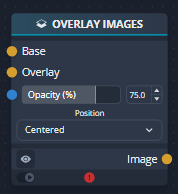
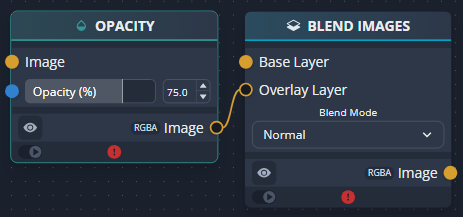
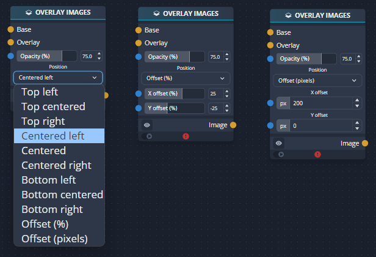
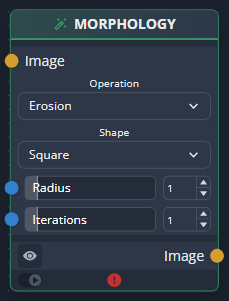
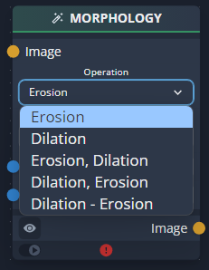
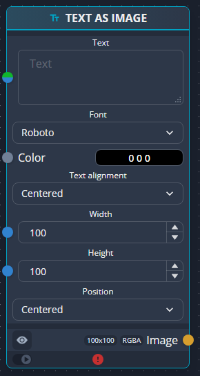
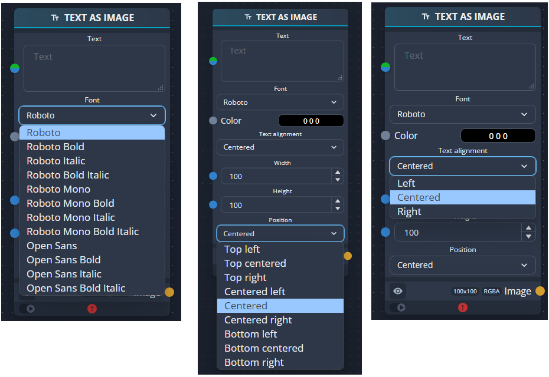
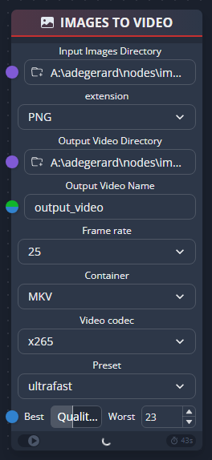
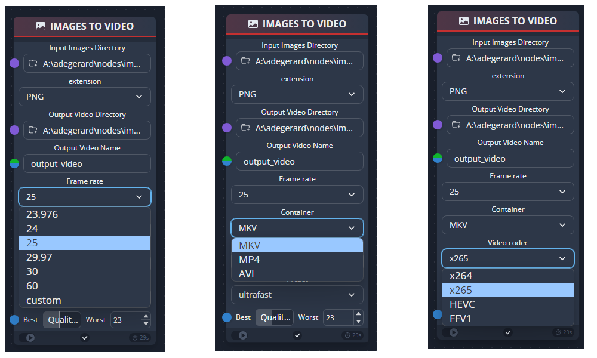

# Extra nodes for chaiNNer

Here are some nodes I developped for chaiNNer: for PoC, for testing purpose, before creating a PR, etc. The nodes can be added to Windows/Linux portable software only.

**This is not a repository made/supported by chaiNNer organization.**

## Compatible chaiNNer version

0.19.3

## Agreements

By using these nodes, you agree to:
- not report any bug to chaiNNer
- not adding these nodes to another chaiNNer version than specified below
- encounter some side effects
- not create any PR to integrate any of these nodes into chaiNNer without my agreement

**Reasons**
- These nodes may have side effects if not validated against your chaiNNer version
- These nodes passed only some basic tests and not a full validation
- Some nodes will be removed from this repository as soon as they are integrated in a chaiNNer release
- Some nodes may not respect chaiNNer philosophy
- I do not have time to do extra stuff for compatibility

**Use at your own risk!**

## Installation

For each node, files have to be copied to the specified directory.

note: installation is done by hand, maybe I will create a script later to do this or provide a zip file.


## <span style="color:red">Nodes</span>

- [Overlay images](#overlay-images)
- [Morphology](#morphology)
- [Text as image](#text-as-image)
- [Images to video](#images-to-video)


### Overlay images
_________________________________________
#### Motivation

Single node to overlay 2 images, more understandable for beginners.

#### Description and usage

This node may be used to overlay 2 images with opacity applied to the overlay image.
<p align="center">
    
</p>
Equivalent to
<p align="center">
    
</p>


Options are the following
<p align="center">
    
</p>
Notes:
The behavior of the following options differs from the options defined in the blend node:

- `Offset (%)`: offset of the **middle* of the overlay image
- `Offset (pixels)`: offset of the **middle* of the overlay image. It is limited so that the overlay image is not completely outside the base image: if it occurs, an error message is displayed when running it

#### Installation

Copy [overlay_images.py](overlay_images/overlay_images.py) to
`chaiNNer-windows-x64-0.19.3-portable\resources\src\packages\chaiNNer_standard\image_utility\compositing`


### Morphology
_________________________________________
#### Motivation

- Create a single node for morphological operations: erosion, dilation, opening, closing and gradient. This node uses the [OpenCV Morphological Transformations](https://docs.opencv.org/4.x/d9/d61/tutorial_py_morphological_ops.html)
- This permits to simply some testing when you want to test different morphological operations without changing node


#### Description and usage

<p align="center">
    
</p>


Options are the following
<p align="center">
    
</p>

- `Erosion`: same transformation as the 'ERODE' node
- `Dilation`: same transformation as the 'DILATE' node
- `Erosion, Dilation`: opening transformation: erosion(s) followed by dilation(s)
- `Dilation, Erosion`: closing transformation: dilation(s) followed by erosion(s)
- `Dilation - Erosion`: gradient transformation: difference between dilation(s) and erosion(s)

(*) About the number of iterations: [OpenCV documentation](https://docs.opencv.org/4.8.0/d4/d86/group__imgproc__filter.html#ga67493776e3ad1a3df63883829375201f):
```
The number of iterations is the number of times erosion or dilation operation will be applied. For instance, an opening operation (MORPH_OPEN) with two iterations is equivalent to apply successively: erode -> erode -> dilate -> dilate (and not erode -> dilate -> erode -> dilate).
```

#### Installation

Copy [morphology.py](morphology/morphology.py) to
`chaiNNer-windows-x64-0.19.3-portable\resources\src\packages\chaiNNer_standard\image_filter\miscellaneous`


### Text as image
_________________________________________

<span style="color:red">For evaluation purpose, still in progress</span>

#### Motivation
This node transforms a text into any image.
It creates an image and add the text to the position specified
It automatically chooses the font size to fit the canva specified by the `width` and `height` options.


#### Description and usage
<p align="center">
    
</p>

Options
<p align="center">
    
</p>


#### Installation

- Copy [text_as_image.py](text_as_image/text_as_image.py) to
`chaiNNer-windows-x64-0.19.3-portable\resources\src\packages\chaiNNer_standard\image_utility\compositing`
- Copy the [fonts](text_as_image/fonts) directory to `chaiNNer-windows-x64-0.19.3-portable\resources\src`


### Images to video
_________________________________________

<span style="color:red">For evaluation purpose, limitations:</span>
- This node has to be the only one in a project. _reason: not tested with other nodes_
- The input folder must already contains images
- There is neither "progress bar" nor estimated time (ETA). _The only way to see if it works is to look at the size of the output video file which is refreshed every minute_
- If something wrong happens, it stops and displays an error message

#### Motivation
Create a video from images stored in a directory.

#### Description and usage
<p align="center">
    
</p>

Options
<p align="center">
    
</p>

- Containers: mkv, mp4, avi. _only a subset of the one supported by FFmpeg, other can be supported, please ask_
- Codec: x264, x265, HEVC, FFv1. _only a subset of the one supported by FFmpeg, other can be supported, please ask_
- Other options: available only for x264, x265

#### Installation

- Copy [images_to_video.py](images_to_video/images_to_video.py) to `chaiNNer-windows-x64-0.19.3-portable\resources\src\packages\chaiNNer_standard\image\io`
- Overwrite [generic_inputs.py](images_to_video/generic_inputs.py) to `chaiNNer-windows-x64-0.19.3-portable\resources\src\nodes\properties\inputs`
- Overwrite [chainner-scope.ts](images_to_video/chainner-scope.ts) to `chaiNNer-windows-x64-0.19.3-portable\resources\src\common\types`


